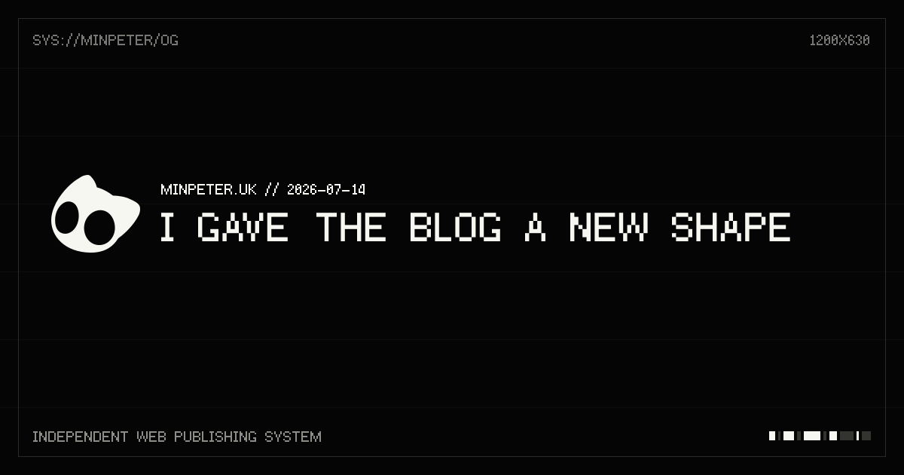

For a while, opening the blog left me with a small sense of regret. The writing kept growing, but the front page still looked like it belonged to a few years ago. My projects and notes were all in the same place, without much of a reason to move from one to the other.

The small character at the centre came from the same impulse. The quiet, readable silhouette of Hollow Knight had stayed with me, but I was not trying to recreate it. I wanted a small, expressive starting point that only belongs to this site. I used Grok Imagine to explore a range of eyes, ears, and negative space, then chose the direction that felt the simplest. Finally, I used QuiverAI's `arrow-1.1` model to turn it into an SVG—one shape that stays clear from the tiny favicon to the mark on the first screen.

<MediaGrid columns="featured">

</MediaGrid>

This time I decided to look at the site as a whole. Instead of adding another feature, I worked on the quieter things: whitespace, type scale, and the way one page leads to the next. The result is a calmer site that is easier to stay with.

## A simpler first impression

The home page now keeps only what it needs to answer two questions: what do I do, and where can you find it? A small icon sits at the center, followed by a short introduction and the links. Black and white do most of the work; the decoration stays out of the way.

<MediaGrid>

</MediaGrid>

At first I thought the empty space meant something was missing. After removing a few more things, the name and the writing became much easier to see. The space is part of the composition now, rather than something I need to fill.

## A place for reading

The blog index is organised around the things I actually look for: year, title, and date. Search is still there, but it no longer competes with the list. On an individual post, the title has room to breathe before the text begins. I wanted the rhythm of reading to matter more than the moment of finding a post.

The same feeling should hold on a phone. Narrow screens stack the content naturally instead of shrinking everything until it becomes difficult to read. Long titles wrap cleanly, and dates and links stay in their own lane.

### The same face when a post leaves the site

The redesign now carries into the link preview, too. Instead of reusing one static thumbnail, every post generates its own 1200×630 Open Graph image from the title and publication date. The cat mark, `MINPETER.UK`, fine grid, and monochrome palette carry the first screen of the site into every shared link.

Korean, English, and Japanese titles use Fusion Pixel 10px Proportional. The translations of a post share one base title scale, while the visible height and baseline differences between Latin and CJK glyphs are compensated per script. That keeps mixed-language titles from changing height halfway through a line. The image below is the actual output generated from this post.

## One visual language across the site

I brought the Showcase and Resume pages into the same visual family as the blog. The navigation, type scale, and starting point for the content now line up, while each page keeps its own character through the content itself.

<MediaGrid>

</MediaGrid>

Showcase is now a quieter list of small experiments. Resume is still being filled in, so I left its generous open space alone instead of pretending it was finished.

## The moments between pages count too

Once the finished pages were in place, I started paying attention to the moment before they arrived. I rebuilt the loading states for the index, individual posts, Showcase, and Resume. A page that briefly turns into unrelated grey boxes can make the site feel like two different places, even if it only lasts a second.

The post skeleton now reserves the same sequence as a real post: the way back, two title lines, a date, then headings and paragraphs.

On a phone, the title blocks reach closer to the edge so long titles do not collapse into a timid little shape. The blog index shows four year groups with three entries each, which keeps the page from suddenly growing in height when the content arrives. Showcase and Resume begin in the same places as their finished counterparts, too.

### Checking the skeleton against the page itself

I did not stop at matching it by eye. I layered the loading screen over the finished version of the same post, at the same viewport, and checked where the title, date, and body begin. These are the desktop and mobile overlays from that pass. The dark bars are the skeleton; the real article rhythm sits underneath.

#### Desktop

<MediaGrid>

</MediaGrid>

Tablet and mobile overlays

#### Tablet

<MediaGrid>

</MediaGrid>

#### Mobile

<MediaGrid>

</MediaGrid>

### Keeping the iterations, too

I also kept the passes where I shortened the detail page's spacing and way-back link, then compared it again after restoring the real design. One image can look close enough on its own; layering the same screen repeatedly makes it much clearer which change brought the rhythm back.

<MediaGrid>

</MediaGrid>

See the remaining iterations

<MediaGrid>

</MediaGrid>

### One view of every loading state

Instead of stopping with a single page, I collected the loading states of all four pages at each viewport. It made it easy to check that headings and lists still begin where they should, even on a small screen.

<MediaGrid columns="overview">

</MediaGrid>

Tablet and mobile collages

<MediaGrid columns="overview">

</MediaGrid>

Loading does not have to temporarily erase the site's first impression. The cat mark is static, so it appears right away instead of becoming a grey square, and screen readers can tell that the page is still busy. The pulse also stops for anyone who prefers reduced motion. I like the idea that even a short in-between state can still feel like part of the site.

## Six pixels, on purpose

At the end, I wanted to make sure the cat mark really began in the same place on every page. It looked close enough at first, but the Home mark was six pixels lower than Blog, Resume, and Showcase. I made same-sized first-screen captures and layered them with transparency. Before is on the left; after is on the right.

<MediaGrid>

</MediaGrid>

The fix was simply to move the Home page's top spacing by six pixels. The mark now starts at the same coordinates on every page that uses it. It is the kind of detail most people will never consciously notice, but it changes how the site feels when moving around it.

## Selection should not disappear

I also tightened the way the site responds while you are reading. Dark mode already had a good selection state, but selected text in light mode was almost impossible to follow. It now gets its own quiet grey highlight, while the dark version keeps its existing contrast. It is a small change, but a real one when copying a sentence out of a long post.

### The tab icon follows the theme

The cat mark shifts softly toward white on a dark background, and the browser-tab favicon uses the same mark while switching with the theme. I wanted the impression to hold not only inside the page, but while selecting text with a mouse or looking across a row of browser tabs.

## Not quite finished—and that's okay

This redesign reminded me that design is often more about choosing what to leave out than adding something new. Every page does not need to look identical, but they should feel like they belong to the same place.

There is still more to tune. I want to see how the index feels as more writing arrives, and how the dark mode holds up on real devices. For now, though, the site is in a state I am happy to share when someone asks what I have been working on lately.
