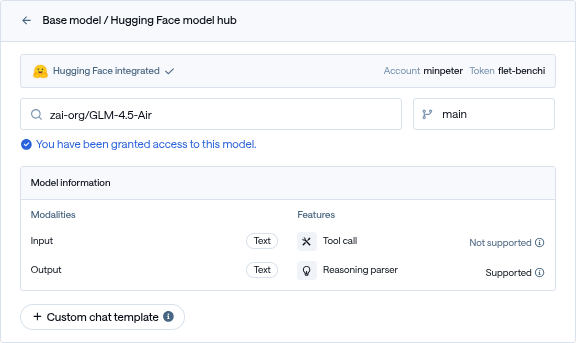
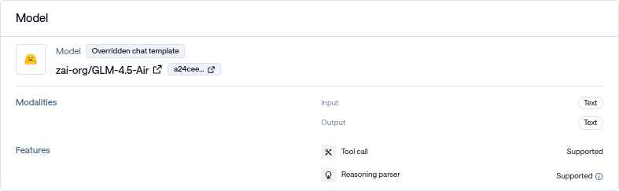

<Callout
  type="info"
  title="本記事はFriendliAIとは直接的な関連がありません。記事の内容と説明はすべて個人的な意見であり、FriendliAIの意見を代弁するものではありません。"
/>


FriendliAIの完全マネージド型モデルサービング製品であるFriendli Dedicated Endpoints（FDE）は、安定的で便利なモデルサービングを提供します。特に関数呼び出し設定が自動的に検出されて有効化される機能をサポートしているため、開発者は別途の複雑な設定なしに簡単にfunction callingを実装できます。


## 関数呼び出しがサポートされるモデルのデプロイ

ほとんどの最新モデルは関数呼び出しを標準でサポートしています。`Qwen/Qwen3-30B-A3B`モデルを例に、次のような簡単な手順で関数呼び出しが可能なエンドポイントをデプロイできます。

1. **モデルの選択と確認**: モデル選択後、Features > Tool call: Supported表示を確認します。
   

2. **エンドポイントIDの確認**: デプロイが完了したらEndpoint OverviewでEndpoint ID（e.g., `dep0hyjaasjus3o`）を確認します。
   

3. **APIテスト**: [`FRIENDLI_TOKEN`](https://friendli.ai/suite/setting/tokens)を発行した後、次のようにAPIリクエストを通じてテストします。

	```plaintext
	curl https://api.friendli.ai/dedicated/v1/chat/completions \
	-H "Content-Type: application/json" \
	// [!code highlight:1]
	-H "Authorization: Bearer $FRIENDLI_TOKEN" \
	-d '{
	// [!code highlight:1]
		"model": "dep0hyjaasjus3o",
		"messages": [
			{"role": "user", "content": "ソウルの天気を教えて"}
		],
		"tools": [
		{
			"type": "function",
			"function": {
			"name": "get_weather",
			"description": "都市の現在の天気を取得",
			"parameters": {
				"type": "object",
				"properties": {
				"location": {"type": "string"}
				},
				"required": ["location"]
			}
			}
		}
		],
		"tool_choice": "auto"
	}' | jq .choices[].message
	```

4. **結果の確認**: 関数が正常に呼び出されると、次のような応答を受け取ることができます。

	```json
	{
		"content": "\n\n",
		"reasoning_content": "\nOkay, the user is asking for the weather in Seoul. Let me check the tools available. There's a function called get_weather that takes a location parameter. Since the user mentioned \"서울\" which is Seoul, I need to call that function with the location set to Seoul. I should make sure the arguments are correctly formatted in JSON. Alright, the required parameter is location, so I'll structure the tool call accordingly.\n",
		"role": "assistant",
		// [!code highlight:10]
		"tool_calls": [
			{
				"function": {
					"arguments": "{\"location\": \"서울\"}",
					"name": "get_weather"
				},
				"id": "call_XIl0NYYMh9jRLhUdhF2OtTjE",
				"type": "function"
			}
		]
	}
	```

このように別途の複雑な設定なしでも関数呼び出しが可能なエンドポイントを簡単にデプロイできます。

## 関数呼び出しがサポートされないモデルの限界と原因

すべてのモデルが関数呼び出しをサポートしているわけではありません。一部のモデルでは「Tool call: Not supported」メッセージを確認できますが、これは主に以下のような理由によるものです。

1. **Chat Templateの限界**: 該当モデルのchat templateにtool callをレンダリングするためのロジックが含まれていない場合です（e.g., `google/gemma-3-27b-it`）。

2. **エンジン互換性の問題**: モデル自体には問題がないものの、エンジンでサポートされていないタイプのツール呼び出し形式を使用している場合です（e.g., `zai-org/GLM-4.5-Air`）。

しかしこのような制限がFDEで完全にツール呼び出しを使用できないという意味ではありません。FDEはchat templateを基盤にtool callタイプを自動検出して設定する機能を提供するため、ユーザー定義のchat templateを活用すればこのような問題を解決できます。

## Custom Chat Templateを活用した解決策

サポートされていないモデルでも関数呼び出しを可能にする核心は、エンジンでサポートする形式のtool call formatでレンダリングを行うchat templateを作成することです。

<Callout
  type="warn"
  title="以下で説明する機能は高度な機能であり、意図しないモデル関数呼び出し性能の低下を引き起こす可能性があります。"
/>

### テンプレート変換プロセス

関数呼び出しがサポートされないモデルを解決する核心は、正しいテンプレート変換プロセスを理解することです。このプロセスは大きく2つの段階に分かれます：

1. **既存テンプレートの分析と整理**: モデルの元のテンプレートからtool call関連ロジックを削除または整理
2. **互換形式への再構成**: エンジンでサポートする標準形式でtool call機能を再度追加

#### 1段階: 純粋なテンプレートの準備

まず各モデルの基本構造を把握する必要があります。モデルごとに状況が異なります：

- Case 1: 元々tool callロジックがないモデル
`google/gemma-3-27b-it`のようなモデルは元々tool callのためのロジックがテンプレートに含まれていません。このような場合は既存のテンプレートをそのまま使用できるため、作業が簡単です。
- Case 2: 互換性のないtool call形式を使用するモデル
`GLM-4.5-Air`のようなモデルはすでにtool call機能が実装されていますが、FDEエンジンでサポートしていない形式を使用しています。このような場合は既存のtool callロジックを削除して純粋な会話テンプレートにする必要があります。

<Tabs items={['gemma-3-27b-it', 'GLM-4.5-Air', 'GLM-4.5-Air (diff)']}>
  <Tab value="gemma-3-27b-it">
```jinja
{{- bos_token -}}

	
		
	
		
	
	

	
	



	{%- if message["role"] == "user" != (loop.index0 % 2 == 0) -%}
		{{- raise_exception("Conversation roles must alternate user/assistant/user/assistant/...") -}}
	
	
		
	
		
	
	{{- "<start_of_turn>" + role + "\n" + (first_user_prefix if loop.first else "") -}}
	
		{{- message["content"] | trim -}}
	
		
			
				{{- "<start_of_image>" -}}
			
				{{- item["text"] | trim -}}
			
		
	
		{{- raise_exception("Invalid content type") -}}
	
	{{- "<end_of_turn>\n" -}}



	{{- "<start_of_turn>model\n" -}}

```
  </Tab>
  <Tab value="GLM-4.5-Air">
```jinja
{{- "[gMASK]<sop>" -}}

	
		{{- content -}}
	
		
			
				{{- item.text -}}
			
				{{- item -}}
			
		
	
		{{- content -}}
	




	
		
	



	
		{{- "<|user|>\n" -}}
		{{- visible_text(m.content) -}}
		{{- "/nothink" if enable_thinking is defined and not enable_thinking and not visible_text(m.content).endswith("/nothink") else "" -}}
	
		{{- "<|assistant|>" -}}
		
		
		
			
		
			
			
		
		
			{{- "\n<think>" + reasoning_content.strip() + "</think>" -}}
		
			{{- "\n<think></think>" -}}
		
		
			{{- "\n" + content.strip() -}}
		
	
		{{- "<|system|>\n" -}}
		{{- visible_text(m.content) -}}
	



	{{- "<|assistant|>" -}}
	{{- "\n<think></think>" if enable_thinking is defined and not enable_thinking else "" -}}

```

  </Tab>
  <Tab value="GLM-4.5-Air (diff)">
```diff
  {{- "[gMASK]<sop>" -}}
- 
- 	{{- "<|system|>\n# Tools\n\nYou may call one or more functions to assist with the user query.\n\nYou are provided with function signatures within <tools></tools> XML tags:\n<tools>\n" -}}
- 	
- 		{{- tool | tojson(ensure_ascii=False) -}}
- 		{{- "\n" -}}
- 	
- 	{{- "</tools>\n\nFor each function call, output the function name and arguments within the following XML format:\n<tool_call>{function-name}\n<arg_key>{arg-key-1}</arg_key>\n<arg_value>{arg-value-1}</arg_value>\n<arg_key>{arg-key-2}</arg_key>\n<arg_value>{arg-value-2}</arg_value>\n...\n</tool_call>" -}}
- 
  
  	
  		{{- content -}}
  	
  		
  			
  				{{- item.text -}}
  			
  				{{- item -}}
  			
  		
  	
  		{{- content -}}
  	
  
  
  
  	
  		
  	
  
  
  	
  		{{- "<|user|>\n" -}}
  		{{- visible_text(m.content) -}}
  		{{- "/nothink" if enable_thinking is defined and not enable_thinking and not visible_text(m.content).endswith("/nothink") else "" -}}
  	
  		{{- "<|assistant|>" -}}
  		
  		
  		
  			
  		
  			
  			
  		
  		
  			{{- "\n<think>" + reasoning_content.strip() + "</think>" -}}
  		
  			{{- "\n<think></think>" -}}
  		
  		
  			{{- "\n" + content.strip() -}}
  		
- 		
- 			
- 				
- 					
- 				
- 				{{- "\n<tool_call>" + tc.name -}}
- 				{{- "\n" -}}
- 				
- 				
- 					{{- "<arg_key>" -}}
- 					{{- k -}}
- 					{{- "</arg_key>\n<arg_value>" -}}
- 					{{- v | tojson(ensure_ascii=False) if v is not string else v -}}
- 					{{- "</arg_value>\n" -}}
- 				
- 				{{- "</tool_call>" -}}
- 			
- 		
- 	
- 		
- 			
- 				{{- "<|observation|>" -}}
- 			
- 			{{- "\n<tool_response>\n" -}}
- 			{{- m.content -}}
- 			{{- "\n</tool_response>" -}}
- 		
- 			{{- "<|observation|>" -}}
- 			
- 				{{- "\n<tool_response>\n" -}}
- 				{{- tr.output if tr.output is defined else tr -}}
- 				{{- "\n</tool_response>" -}}
- 			
- 		
  	
  		{{- "<|system|>\n" -}}
  		{{- visible_text(m.content) -}}
  	
  
  
  	{{- "<|assistant|>" -}}
  	{{- "\n<think></think>" if enable_thinking is defined and not enable_thinking else "" -}}
  
```
  </Tab>
</Tabs>

#### 2段階: 互換可能なtool call機能の追加

純粋なテンプレートを準備したら、FDEエンジンで認識できる形式でtool call機能を追加する必要があります。最も広く使用されている形式は[Hermes Function Calling Standard](https://github.com/NousResearch/Hermes-Function-Calling)形式です。
この形式の主な特徴は以下の通りです：

- Tool定義: `<tools>...</tools>` XMLタグ内にJSON形式で定義
- Tool呼び出し: `<tool_call>{"name": "関数名", "arguments": {...}}</tool_call>` 形式で呼び出し
- Tool応答: `<tool_response>...</tool_response>` 形式で結果を伝達

<Tabs items={[
  "gemma-3-27b-it",
  "GLM-4.5-Air",
  "GLM-4.5-Air (diff)",
]}>
  <Tab value="gemma-3-27b-it">
```jinja
{{- bos_token -}}

	
		
			
		
			
		
		
		
			
		
		
		
	
		
		
			
		
		
		
	

	
		
			
		
			
		
		
	
		
		
	



	
		
			{{- "<start_of_turn>user\n" -}}
		
		{{- "<tool_response>\n" -}}
		
			{{- message["content"] | trim -}}
		
			{{- message["content"][0]["text"] | trim -}}
		
		{{- "\n</tool_response>" -}}
		
			{{- "<end_of_turn>\n" -}}
		
	
		{%- if message["role"] == "user" != ((loop.index0 - (loop_messages[:loop.index0] | selectattr("role", "equalto", "tool") | list | length)) % 2 == 0) -%}
			{{- raise_exception("Conversation roles must alternate user/assistant/user/assistant/... (excluding tool messages)") -}}
		
		
			
		
			
		
		{{- "<start_of_turn>" + role + "\n" + (first_user_prefix if loop.first and role == "user" else "") -}}
		
			{{- message["content"] | trim -}}
		
			
				
					{{- "<start_of_image>" -}}
				
					{{- item["text"] | trim -}}
				
			
		
			{{- raise_exception("Invalid content type") -}}
		
		
			
				{{- "\n" -}}
				
					
				
				{{- "<tool_call>\n{\"name\": \"" -}}
				{{- tool_call["name"] -}}
				{{- "\", \"arguments\": " -}}
				
					{{- tool_call["arguments"] -}}
				
					{{- tool_call["arguments"] | tojson -}}
				
				{{- "}\n</tool_call>" -}}
			
		
		{{- "<end_of_turn>\n" -}}
	



	{{- "<start_of_turn>model\n" -}}

```
  </Tab>
  <Tab value="GLM-4.5-Air">
```jinja
{{- "[gMASK]<sop>" -}}
{# --- Tools Definition Block from the new template --- #}

    {{- '<|system|>\n' }}
    
        {{- messages[0].content + '\n\n' }}
    
    {{- "# Tools\n\nYou may call one or more functions to assist with the user query.\n\nYou are provided with function signatures within <tools></tools> XML tags:\n<tools>" }}
    
        {{- "\n" }}
        {{- tool | tojson }}
    
    {{- "\n</tools>\n\nFor each function call, return a json object with function name and arguments within <tool_call></tool_call> XML tags:\n<tool_call>\n{\"name\": <function-name>, \"arguments\": <args-json-object>}\n</tool_call>" }}

    
        {{- '<|system|>\n' + messages[0].content }}
    


{# --- Main message loop structure from the original template --- #}

	
		{{- content -}}
	
		
			
				{{- item.text -}}
			
				{{- item -}}
			
		
	
		{{- content -}}
	




	
		
	



	
		{{- "<|user|>\n" -}}
		{{- visible_text(m.content) -}}
		{{- "/nothink" if enable_thinking is defined and not enable_thinking and not visible_text(m.content).endswith("/nothink") else "" -}}
	
		{{- "<|assistant|>" -}}
		
		
		
			
		
			
			
		
		
			{{- "\n<think>" + reasoning_content.strip() + "</think>" -}}
		
			{{- "\n<think></think>" -}}
		
		
			{{- "\n" + content.strip() -}}
		
        {# --- Tool Call Rendering Block from the new template --- #}
		
			
                
                    {{- '\n' }}
                
				
					
				
				{{- '<tool_call>\n{"name": "' }}
				{{- tool_call.name }}
				{{- '", "arguments": ' }}
				
					{{- tool_call.arguments }}
				
					{{- tool_call.arguments | tojson }}
				
				{{- '}\n</tool_call>' }}
			
		
    {# --- Tool Response Rendering Block from the new template --- #}
	
        {{- '\n<tool_response>\n' }}
        {{- visible_text(m.content) }}
        {{- '\n</tool_response>' }}
	
		{{- "<|system|>\n" -}}
		{{- visible_text(m.content) -}}
	


{# --- Generation prompt from the original template --- #}

	{{- "<|assistant|>" -}}
	{{- "\n<think></think>" if enable_thinking is defined and not enable_thinking else "" -}}

```
  </Tab>
  <Tab value="GLM-4.5-Air (diff)">
```diff
  {{- "[gMASK]<sop>" -}}
+ {# --- Tools Definition Block from the new template --- #}
+ 
+     {{- '<|system|>\n' }}
+     
+         {{- messages[0].content + '\n\n' }}
+     
+     {{- "# Tools\n\nYou may call one or more functions to assist with the user query.\n\nYou are provided with function signatures within <tools></tools> XML tags:\n<tools>" }}
+     
+         {{- "\n" }}
+         {{- tool | tojson }}
+     
+     {{- "\n</tools>\n\nFor each function call, return a json object with function name and arguments within <tool_call></tool_call> XML tags:\n<tool_call>\n{\"name\": <function-name>, \"arguments\": <args-json-object>}\n</tool_call>" }}
+ 
+     
+         {{- '<|system|>\n' + messages[0].content }}
+     
+ 
+
+ {# --- Main message loop structure from the original template --- #}
  
  	
  		{{- content -}}
  	
  		
  			
  				{{- item.text -}}
  			
  				{{- item -}}
  			
  		
  	
  		{{- content -}}
  	
  
  
  
  	
  		
  	
  
  
  	
  		{{- "<|user|>\n" -}}
  		{{- visible_text(m.content) -}}
  		{{- "/nothink" if enable_thinking is defined and not enable_thinking and not visible_text(m.content).endswith("/nothink") else "" -}}
  	
  		{{- "<|assistant|>" -}}
  		
  		
  		
  			
  		
  			
  			
  		
  		
  			{{- "\n<think>" + reasoning_content.strip() + "</think>" -}}
  		
  			{{- "\n<think></think>" -}}
  		
  		
  			{{- "\n" + content.strip() -}}
  		
+         {# --- Tool Call Rendering Block from the new template --- #}
+ 		
+ 			
+                 
+                     {{- '\n' }}
+                 
+ 				
+ 					
+ 				
+ 				{{- '<tool_call>\n{"name": "' }}
+ 				{{- tool_call.name }}
+ 				{{- '", "arguments": ' }}
+ 				
+ 					{{- tool_call.arguments }}
+ 				
+ 					{{- tool_call.arguments | tojson }}
+ 				
+ 				{{- '}\n</tool_call>' }}
+ 			
+ 		
+     {# --- Tool Response Rendering Block from the new template --- #}
+ 	
+         {{- '\n<tool_response>\n' }}
+         {{- visible_text(m.content) }}
+         {{- '\n</tool_response>' }}
- 	
+ 	
  		{{- "<|system|>\n" -}}
  		{{- visible_text(m.content) -}}
  	
  
+ {# --- Generation prompt from the original template --- #}
  
  	{{- "<|assistant|>" -}}
  	{{- "\n<think></think>" if enable_thinking is defined and not enable_thinking else "" -}}
  
```
</Tab>
</Tabs>

### カスタムテンプレートを使用したデプロイ

修正されたテンプレートを活用して、実際に関数呼び出しがサポートされていなかったモデルをデプロイするプロセスを段階的に見ていきましょう。

1. **モデル状態の確認**: まずモデルを選択した後、「Tool call: Not supported」状態であることを確認します。
   

2. **カスタムテンプレートの適用**: 「Custom chat template」を選択し、作成したchat templateを貼り付けます。
   

3. **設定のオーバーライド**: 「Override」を選択した後、tool call情報が「unknown」と表示されることを確認します。
   

4. **デプロイ完了の確認**: デプロイが完了した後、Overviewでtool callが「supported」に変更されたことを確認します。
   

5. **APIテスト**: 以前と同じ方法でAPI呼び出しを通じてテストします。
	```text
	curl https://api.friendli.ai/dedicated/v1/chat/completions \
	-H "Content-Type: application/json" \
	// [!code highlight:1]
	-H "Authorization: Bearer $FRIENDLI_TOKEN" \
	-d '{
	// [!code highlight:1]
		"model": "depp771mey8y1se",
		"messages": [
		{"role": "user", "content": "ソウルの天気を教えて"}
		],
		"tools": [
		{
			"type": "function",
			"function": {
			"name": "get_weather",
			"description": "都市の現在の天気を取得",
			"parameters": {
				"type": "object",
				"properties": {
				"location": {"type": "string"}
				},
				"required": ["location"]
			}
			}
		}
		],
		"tool_choice": "auto"
	}' | jq .choices[].message
	```

6. **成功結果の確認**: これで以前はサポートされていなかったGLM-4.5-Airモデルでも関数呼び出しが正常に動作するようになります：
	```json
	{
		"content": "\n\nソウルの現在の天気を確認いたします。\n",
		"reasoning_content": "ユーザーがソウルの天気を教えてほしいと要求しました。私が持っている`get_weather`関数を使用できます。この関数にはlocationパラメータが必要で、ユーザーが「ソウル」という場所を明示的に言及しました。\n\n関数を呼び出す際に「ソウル」をlocationパラメータとして渡す必要があります。",
		"role": "assistant",
		// [!code highlight:10]
		"tool_calls": [
			{
				"function": {
						"arguments": "{\"location\": \"서울\"}",
						"name": "get_weather"
				},
				"id": "call_oaNZe3tgKLLgv5aUMFQNBTRr",
				"type": "function"
			}
		]
	}
	```

### 活用範囲の拡張

このような方式を応用すれば、非常に興味深い結果を得ることができます。関数呼び出しの学習をまったく受けていない`mistralai/Mistral-7B-Instruct-v0.1`のような初期モデルでも、ある程度優れた関数呼び出し性能を示すことを確認できます。


## おわりに

Friendli Dedicated Endpointsはモデルのデプロイから関数呼び出し設定まで全プロセスを簡素化した優れたサービングプラットフォームです。

サポートされているモデルの場合、別途の設定なしでも即座にAgentic workflowを実装でき、開発生産性を大幅に向上させます。
サポートされていないモデルの場合でも、Custom Chat Template機能を通じて手動で関数呼び出しを有効化できます。これは単に既存の制約を回避するだけでなく、様々なモデルの潜在能力を最大限に活用できる強力な機能です。

結果的にFDEは関数呼び出しサポートの有無に関係なく、ほぼすべてのモデルでツール呼び出し機能を活用できる柔軟性と拡張性を提供すると言えます。このような特徴はAIエージェント開発と複合的なAIワークフロー構築において非常に大きな価値を提供します。
