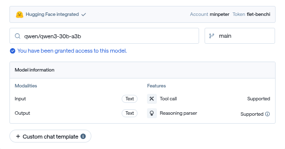
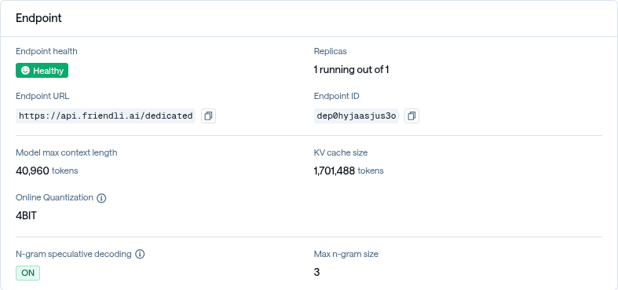
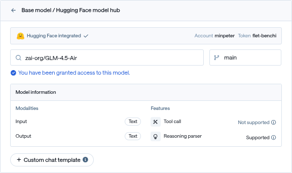
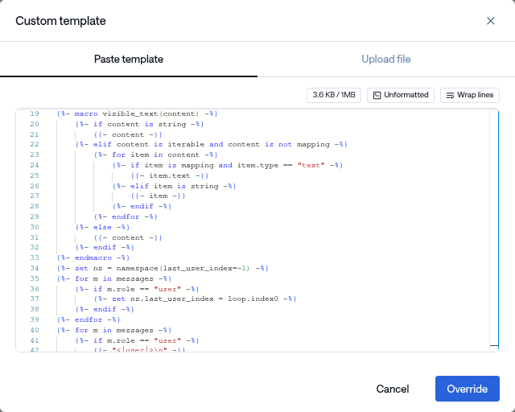
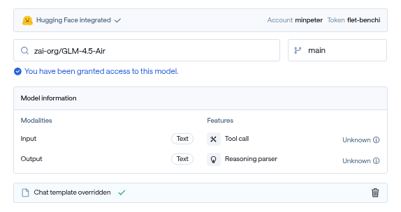
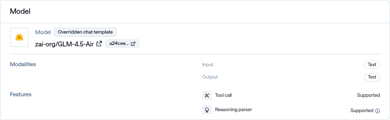

<Callout
  type="info"
  title="본 게시글은 FriendliAI와 직접적인 연관이 없습니다, 글에 내용과 설명 모두 개인적인 의견이며, FriendliAI의 의견을 대변하지 않습니다."
/>


FriendliAI의 완전관리형 모델 서빙 제품인 Friendli Dedicated Endpoints(FDE)는 안정적이고 편리한 모델 서빙을 제공합니다. 특히 함수 호출 설정이 자동으로 감지되어 활성화되는 기능을 지원하여, 개발자가 별도의 복잡한 설정 없이도 쉽게 function calling을 구현할 수 있습니다.


## 함수 호출이 지원되는 모델 배포하기

대부분의 최신 모델들은 함수 호출을 기본적으로 지원합니다. `Qwen/Qwen3-30B-A3B` 모델을 예시로, 다음과 같은 간단한 절차로 함수 호출이 가능한 엔드포인트를 배포할 수 있습니다.

1. **모델 선택 및 확인**: 모델 선택 후 Features > Tool call: Supported 표시를 확인합니다.
   

2. **엔드포인트 ID 확인**: 배포가 완료되면 Endpoint Overview에서 Endpoint ID(e.g., `dep0hyjaasjus3o`)를 확인합니다.
   

3. **API 테스트**: [`FRIENDLI_TOKEN`](https://friendli.ai/suite/setting/tokens)을 발급받은 후, 다음과 같이 API 요청을 통해 테스트합니다.

	```plaintext
	curl https://api.friendli.ai/dedicated/v1/chat/completions \
	-H "Content-Type: application/json" \
	// [!code highlight:1]
	-H "Authorization: Bearer $FRIENDLI_TOKEN" \
	-d '{
	// [!code highlight:1]
		"model": "dep0hyjaasjus3o",
		"messages": [
			{"role": "user", "content": "서울 날씨 알려줘"}
		],
		"tools": [
		{
			"type": "function",
			"function": {
			"name": "get_weather",
			"description": "도시의 현재 날씨를 가져옴",
			"parameters": {
				"type": "object",
				"properties": {
				"location": {"type": "string"}
				},
				"required": ["location"]
			}
			}
		}
		],
		"tool_choice": "auto"
	}' | jq .choices[].message
	```

4. **결과 확인**: 성공적으로 함수가 호출되면 다음과 같은 응답을 받을 수 있습니다.

	```json
	{
		"content": "\n\n",
		"reasoning_content": "\nOkay, the user is asking for the weather in Seoul. Let me check the tools available. There's a function called get_weather that takes a location parameter. Since the user mentioned \"서울\" which is Seoul, I need to call that function with the location set to Seoul. I should make sure the arguments are correctly formatted in JSON. Alright, the required parameter is location, so I'll structure the tool call accordingly.\n",
		"role": "assistant",
		// [!code highlight:10]
		"tool_calls": [
			{
				"function": {
					"arguments": "{\"location\": \"서울\"}",
					"name": "get_weather"
				},
				"id": "call_XIl0NYYMh9jRLhUdhF2OtTjE",
				"type": "function"
			}
		]
	}
	```

이처럼 별도의 복잡한 설정 없이도 함수 호출이 가능한 엔드포인트를 손쉽게 배포할 수 있습니다.

## 함수 호출이 지원되지 않는 모델의 한계와 원인

모든 모델이 함수 호출을 지원하는 것은 아닙니다. 일부 모델에서는 "Tool call: Not supported" 메시지를 확인할 수 있는데, 이는 주로 다음과 같은 이유 때문입니다.

1. **Chat Template의 한계**: 해당 모델의 chat template에 tool call을 렌더링하기 위한 로직이 포함되지 않은 경우입니다 (e.g., `google/gemma-3-27b-it`).

2. **엔진 호환성 문제**: 모델 자체에는 문제가 없지만, 엔진에서 지원되지 않는 유형의 도구 호출 형식을 사용하는 경우입니다 (e.g., `zai-org/GLM-4.5-Air`).

하지만 이러한 제한사항이 FDE에서 완전히 도구 호출을 사용할 수 없다는 의미는 아닙니다. FDE는 chat template을 기반으로 tool call 유형을 자동 감지하고 설정하는 기능을 제공하므로, 사용자 정의 chat template을 활용하면 이러한 문제를 해결할 수 있습니다.

## Custom Chat Template을 활용한 해결 방안

지원되지 않는 모델에 대해서도 함수 호출을 가능하게 하는 핵심은 엔진에서 지원하는 형식의 tool call format으로 렌더링을 수행하는 chat template을 작성하는 것입니다.

<Callout
  type="warn"
  title="아래에서 설명하는 기능은 고급 기능으로, 의도치 않는 모델 함수 호출 성능 저하를 일으킬 수 있습니다."
/>

### 템플릿 변환 과정

함수 호출이 지원되지 않는 모델을 해결하는 핵심은 올바른 템플릿 변환 과정을 이해하는 것입니다. 이 과정은 크게 두 단계로 나뉩니다:

1. **기존 템플릿 분석 및 정리**: 모델의 원본 템플릿에서 tool call 관련 로직을 제거하거나 정리
2. **호환 형식으로 재구성**: 엔진에서 지원하는 표준 형식으로 tool call 기능을 다시 추가

#### 1단계: 순수 템플릿 준비하기

먼저 각 모델의 기본 구조를 파악해야 합니다. 모델마다 상황이 다릅니다:

- Case 1: 원래부터 tool call 로직이 없는 모델
`google/gemma-3-27b-it` 같은 모델은 애초에 tool call을 위한 로직이 템플릿에 포함되어 있지 않습니다. 이런 경우 기존 템플릿을 그대로 사용할 수 있어서 작업이 간단합니다.
- Case 2: 호환되지 않는 tool call 형식을 사용하는 모델
`GLM-4.5-Air` 같은 모델은 이미 tool call 기능이 구현되어 있지만, FDE 엔진에서 지원하지 않는 형식을 사용합니다. 이런 경우 기존의 tool call 로직을 제거하여 순수한 대화 템플릿으로 만들어야 합니다.

<Tabs items={['gemma-3-27b-it', 'GLM-4.5-Air', 'GLM-4.5-Air (diff)']}>
  <Tab value="gemma-3-27b-it">
```jinja
{{- bos_token -}}

	
		
	
		
	
	

	
	



	{%- if message["role"] == "user" != (loop.index0 % 2 == 0) -%}
		{{- raise_exception("Conversation roles must alternate user/assistant/user/assistant/...") -}}
	
	
		
	
		
	
	{{- "<start_of_turn>" + role + "\n" + (first_user_prefix if loop.first else "") -}}
	
		{{- message["content"] | trim -}}
	
		
			
				{{- "<start_of_image>" -}}
			
				{{- item["text"] | trim -}}
			
		
	
		{{- raise_exception("Invalid content type") -}}
	
	{{- "<end_of_turn>\n" -}}



	{{- "<start_of_turn>model\n" -}}

```
  </Tab>
  <Tab value="GLM-4.5-Air">
```jinja
{{- "[gMASK]<sop>" -}}

	
		{{- content -}}
	
		
			
				{{- item.text -}}
			
				{{- item -}}
			
		
	
		{{- content -}}
	




	
		
	



	
		{{- "<|user|>\n" -}}
		{{- visible_text(m.content) -}}
		{{- "/nothink" if enable_thinking is defined and not enable_thinking and not visible_text(m.content).endswith("/nothink") else "" -}}
	
		{{- "<|assistant|>" -}}
		
		
		
			
		
			
			
		
		
			{{- "\n<think>" + reasoning_content.strip() + "</think>" -}}
		
			{{- "\n<think></think>" -}}
		
		
			{{- "\n" + content.strip() -}}
		
	
		{{- "<|system|>\n" -}}
		{{- visible_text(m.content) -}}
	



	{{- "<|assistant|>" -}}
	{{- "\n<think></think>" if enable_thinking is defined and not enable_thinking else "" -}}

```

  </Tab>
  <Tab value="GLM-4.5-Air (diff)">
```diff
  {{- "[gMASK]<sop>" -}}
- 
- 	{{- "<|system|>\n# Tools\n\nYou may call one or more functions to assist with the user query.\n\nYou are provided with function signatures within <tools></tools> XML tags:\n<tools>\n" -}}
- 	
- 		{{- tool | tojson(ensure_ascii=False) -}}
- 		{{- "\n" -}}
- 	
- 	{{- "</tools>\n\nFor each function call, output the function name and arguments within the following XML format:\n<tool_call>{function-name}\n<arg_key>{arg-key-1}</arg_key>\n<arg_value>{arg-value-1}</arg_value>\n<arg_key>{arg-key-2}</arg_key>\n<arg_value>{arg-value-2}</arg_value>\n...\n</tool_call>" -}}
- 
  
  	
  		{{- content -}}
  	
  		
  			
  				{{- item.text -}}
  			
  				{{- item -}}
  			
  		
  	
  		{{- content -}}
  	
  
  
  
  	
  		
  	
  
  
  	
  		{{- "<|user|>\n" -}}
  		{{- visible_text(m.content) -}}
  		{{- "/nothink" if enable_thinking is defined and not enable_thinking and not visible_text(m.content).endswith("/nothink") else "" -}}
  	
  		{{- "<|assistant|>" -}}
  		
  		
  		
  			
  		
  			
  			
  		
  		
  			{{- "\n<think>" + reasoning_content.strip() + "</think>" -}}
  		
  			{{- "\n<think></think>" -}}
  		
  		
  			{{- "\n" + content.strip() -}}
  		
- 		
- 			
- 				
- 					
- 				
- 				{{- "\n<tool_call>" + tc.name -}}
- 				{{- "\n" -}}
- 				
- 				
- 					{{- "<arg_key>" -}}
- 					{{- k -}}
- 					{{- "</arg_key>\n<arg_value>" -}}
- 					{{- v | tojson(ensure_ascii=False) if v is not string else v -}}
- 					{{- "</arg_value>\n" -}}
- 				
- 				{{- "</tool_call>" -}}
- 			
- 		
- 	
- 		
- 			
- 				{{- "<|observation|>" -}}
- 			
- 			{{- "\n<tool_response>\n" -}}
- 			{{- m.content -}}
- 			{{- "\n</tool_response>" -}}
- 		
- 			{{- "<|observation|>" -}}
- 			
- 				{{- "\n<tool_response>\n" -}}
- 				{{- tr.output if tr.output is defined else tr -}}
- 				{{- "\n</tool_response>" -}}
- 			
- 		
  	
  		{{- "<|system|>\n" -}}
  		{{- visible_text(m.content) -}}
  	
  
  
  	{{- "<|assistant|>" -}}
  	{{- "\n<think></think>" if enable_thinking is defined and not enable_thinking else "" -}}
  
```
  </Tab>
</Tabs>

#### 2단계: 호환 가능한 tool call 기능 추가하기

순수한 템플릿을 준비했다면, 이제 FDE 엔진에서 인식할 수 있는 형식으로 tool call 기능을 추가해야 합니다. 가장 널리 사용되는 표준은 [Hermes Function Calling Standard](https://github.com/NousResearch/Hermes-Function-Calling) 형식입니다.
이 표준의 핵심 특징은 다음과 같습니다:

- Tool 정의: `<tools>...</tools>` XML 태그 내에 JSON 형식으로 정의
- Tool 호출: `<tool_call>{"name": "함수명", "arguments": {...}}</tool_call>` 형식으로 호출
- Tool 응답: `<tool_response>...</tool_response>` 형식으로 결과 전달

<Tabs items={[
  "gemma-3-27b-it",
  "GLM-4.5-Air",
  "GLM-4.5-Air (diff)",
]}>
  <Tab value="gemma-3-27b-it">
```jinja
{{- bos_token -}}

	
		
			
		
			
		
		
		
			
		
		
		
	
		
		
			
		
		
		
	

	
		
			
		
			
		
		
	
		
		
	



	
		
			{{- "<start_of_turn>user\n" -}}
		
		{{- "<tool_response>\n" -}}
		
			{{- message["content"] | trim -}}
		
			{{- message["content"][0]["text"] | trim -}}
		
		{{- "\n</tool_response>" -}}
		
			{{- "<end_of_turn>\n" -}}
		
	
		{%- if message["role"] == "user" != ((loop.index0 - (loop_messages[:loop.index0] | selectattr("role", "equalto", "tool") | list | length)) % 2 == 0) -%}
			{{- raise_exception("Conversation roles must alternate user/assistant/user/assistant/... (excluding tool messages)") -}}
		
		
			
		
			
		
		{{- "<start_of_turn>" + role + "\n" + (first_user_prefix if loop.first and role == "user" else "") -}}
		
			{{- message["content"] | trim -}}
		
			
				
					{{- "<start_of_image>" -}}
				
					{{- item["text"] | trim -}}
				
			
		
			{{- raise_exception("Invalid content type") -}}
		
		
			
				{{- "\n" -}}
				
					
				
				{{- "<tool_call>\n{\"name\": \"" -}}
				{{- tool_call["name"] -}}
				{{- "\", \"arguments\": " -}}
				
					{{- tool_call["arguments"] -}}
				
					{{- tool_call["arguments"] | tojson -}}
				
				{{- "}\n</tool_call>" -}}
			
		
		{{- "<end_of_turn>\n" -}}
	



	{{- "<start_of_turn>model\n" -}}

```
  </Tab>
  <Tab value="GLM-4.5-Air">
```jinja
{{- "[gMASK]<sop>" -}}
{# --- Tools Definition Block from the new template --- #}

    {{- '<|system|>\n' }}
    
        {{- messages[0].content + '\n\n' }}
    
    {{- "# Tools\n\nYou may call one or more functions to assist with the user query.\n\nYou are provided with function signatures within <tools></tools> XML tags:\n<tools>" }}
    
        {{- "\n" }}
        {{- tool | tojson }}
    
    {{- "\n</tools>\n\nFor each function call, return a json object with function name and arguments within <tool_call></tool_call> XML tags:\n<tool_call>\n{\"name\": <function-name>, \"arguments\": <args-json-object>}\n</tool_call>" }}

    
        {{- '<|system|>\n' + messages[0].content }}
    


{# --- Main message loop structure from the original template --- #}

	
		{{- content -}}
	
		
			
				{{- item.text -}}
			
				{{- item -}}
			
		
	
		{{- content -}}
	




	
		
	



	
		{{- "<|user|>\n" -}}
		{{- visible_text(m.content) -}}
		{{- "/nothink" if enable_thinking is defined and not enable_thinking and not visible_text(m.content).endswith("/nothink") else "" -}}
	
		{{- "<|assistant|>" -}}
		
		
		
			
		
			
			
		
		
			{{- "\n<think>" + reasoning_content.strip() + "</think>" -}}
		
			{{- "\n<think></think>" -}}
		
		
			{{- "\n" + content.strip() -}}
		
        {# --- Tool Call Rendering Block from the new template --- #}
		
			
                
                    {{- '\n' }}
                
				
					
				
				{{- '<tool_call>\n{"name": "' }}
				{{- tool_call.name }}
				{{- '", "arguments": ' }}
				
					{{- tool_call.arguments }}
				
					{{- tool_call.arguments | tojson }}
				
				{{- '}\n</tool_call>' }}
			
		
    {# --- Tool Response Rendering Block from the new template --- #}
	
        {{- '\n<tool_response>\n' }}
        {{- visible_text(m.content) }}
        {{- '\n</tool_response>' }}
	
		{{- "<|system|>\n" -}}
		{{- visible_text(m.content) -}}
	


{# --- Generation prompt from the original template --- #}

	{{- "<|assistant|>" -}}
	{{- "\n<think></think>" if enable_thinking is defined and not enable_thinking else "" -}}

```
  </Tab>
  <Tab value="GLM-4.5-Air (diff)">
```diff
  {{- "[gMASK]<sop>" -}}
+ {# --- Tools Definition Block from the new template --- #}
+ 
+     {{- '<|system|>\n' }}
+     
+         {{- messages[0].content + '\n\n' }}
+     
+     {{- "# Tools\n\nYou may call one or more functions to assist with the user query.\n\nYou are provided with function signatures within <tools></tools> XML tags:\n<tools>" }}
+     
+         {{- "\n" }}
+         {{- tool | tojson }}
+     
+     {{- "\n</tools>\n\nFor each function call, return a json object with function name and arguments within <tool_call></tool_call> XML tags:\n<tool_call>\n{\"name\": <function-name>, \"arguments\": <args-json-object>}\n</tool_call>" }}
+ 
+     
+         {{- '<|system|>\n' + messages[0].content }}
+     
+ 
+ 
+ {# --- Main message loop structure from the original template --- #}
  
  	
  		{{- content -}}
  	
  		
  			
  				{{- item.text -}}
  			
  				{{- item -}}
  			
  		
  	
  		{{- content -}}
  	
  
  
  
  	
  		
  	
  
  
  	
  		{{- "<|user|>\n" -}}
  		{{- visible_text(m.content) -}}
  		{{- "/nothink" if enable_thinking is defined and not enable_thinking and not visible_text(m.content).endswith("/nothink") else "" -}}
  	
  		{{- "<|assistant|>" -}}
  		
  		
  		
  			
  		
  			
  			
  		
  		
  			{{- "\n<think>" + reasoning_content.strip() + "</think>" -}}
  		
  			{{- "\n<think></think>" -}}
  		
  		
  			{{- "\n" + content.strip() -}}
  		
+         {# --- Tool Call Rendering Block from the new template --- #}
+ 		
+ 			
+                 
+                     {{- '\n' }}
+                 
+ 				
+ 					
+ 				
+ 				{{- '<tool_call>\n{"name": "' }}
+ 				{{- tool_call.name }}
+ 				{{- '", "arguments": ' }}
+ 				
+ 					{{- tool_call.arguments }}
+ 				
+ 					{{- tool_call.arguments | tojson }}
+ 				
+ 				{{- '}\n</tool_call>' }}
+ 			
+ 		
+     {# --- Tool Response Rendering Block from the new template --- #}
+ 	
+         {{- '\n<tool_response>\n' }}
+         {{- visible_text(m.content) }}
+         {{- '\n</tool_response>' }}
- 	
+ 	
  		{{- "<|system|>\n" -}}
  		{{- visible_text(m.content) -}}
  	
  
+ {# --- Generation prompt from the original template --- #}
  
  	{{- "<|assistant|>" -}}
  	{{- "\n<think></think>" if enable_thinking is defined and not enable_thinking else "" -}}
  
```
</Tab>
</Tabs>

### 커스텀 템플릿을 이용한 배포

수정된 템플릿을 활용하여 실제로 함수 호출이 지원되지 않던 모델을 배포하는 과정을 단계별로 살펴보겠습니다.

1. **모델 상태 확인**: 먼저 모델을 선택한 후 "Tool call: Not supported" 상태임을 확인합니다.
   

2. **커스텀 템플릿 적용**: "Custom chat template"을 선택하고 작성한 chat template을 붙여넣습니다.
   

3. **설정 오버라이드**: "Override"를 선택한 후 tool call 정보가 "unknown"으로 표시되는지 확인합니다.
   

4. **배포 완료 확인**: 배포가 완료된 후 Overview에서 tool call이 "supported"로 변경되었는지 확인합니다.
   

5. **API 테스트**: 이전과 동일한 방식으로 API 호출을 통해 테스트합니다.
	```text
	curl https://api.friendli.ai/dedicated/v1/chat/completions \
	-H "Content-Type: application/json" \
	// [!code highlight:1]
	-H "Authorization: Bearer $FRIENDLI_TOKEN" \
	-d '{
	// [!code highlight:1]
		"model": "depp771mey8y1se",
		"messages": [
		{"role": "user", "content": "서울 날씨 알려줘"}
		],
		"tools": [
		{
			"type": "function",
			"function": {
			"name": "get_weather",
			"description": "도시의 현재 날씨를 가져옴",
			"parameters": {
				"type": "object",
				"properties": {
				"location": {"type": "string"}
				},
				"required": ["location"]
			}
			}
		}
		],
		"tool_choice": "auto"
	}' | jq .choices[].message
	```

6. **성공 결과 확인**: 이제 기존에 지원되지 않던 GLM-4.5-Air 모델에서도 성공적으로 함수 호출이 가능해집니다:
	```json
	{
		"content": "\n\n서울의 현재 날씨를 확인해 드리겠습니다.\n",
		"reasoning_content": "사용자가 서울의 날씨를 알려달라고 요청했습니다. 제가 가진 `get_weather` 함수를 사용할 수 있습니다. 이 함수는 location 파라미터가 필요하며, 사용자가 \"서울\"이라는 위치를 명시적으로 언급했습니다.\n\n함수를 호출할 때 \"서울\"을 location 파라미터로 전달해야 합니다.",
		"role": "assistant",
		// [!code highlight:10]
		"tool_calls": [
			{
				"function": {
						"arguments": "{\"location\": \"서울\"}",
						"name": "get_weather"
				},
				"id": "call_oaNZe3tgKLLgv5aUMFQNBTRr",
				"type": "function"
			}
		]
	}
	```

### 활용 범위의 확장

이러한 방식을 응용하면 매우 흥미로운 결과를 얻을 수 있습니다. 심지어 함수 호출 학습을 전혀 받지 않은 `mistralai/Mistral-7B-Instruct-v0.1` 같은 초기 모델에서도 어느 정도 준수한 함수 호출 성능을 보여주는 것을 확인할 수 있습니다.


## 마치며

Friendli Dedicated Endpoints는 모델 배포부터 함수 호출 설정까지 전 과정을 간소화한 뛰어난 서빙 플랫폼입니다.

지원 모델의 경우, 별도의 설정 없이도 즉시 Agentic workflow를 구현할 수 있어 개발 생산성을 크게 향상시킵니다.  
지원되지 않는 모델의 경우에도 Custom Chat Template 기능을 통해 수동으로 함수 호출을 활성화할 수 있습니다. 이는 단순히 기존 제약을 우회하는 것을 넘어서, 다양한 모델의 잠재력을 최대한 활용할 수 있는 강력한 기능입니다.

결과적으로 FDE는 함수 호출 지원 여부에 관계없이 거의 모든 모델에서 도구 호출 기능을 활용할 수 있는 유연성과 확장성을 제공한다고 할 수 있습니다. 이러한 특징은 AI 에이전트 개발과 복합적인 AI 워크플로우 구축에 있어 매우 큰 가치를 제공합니다.

