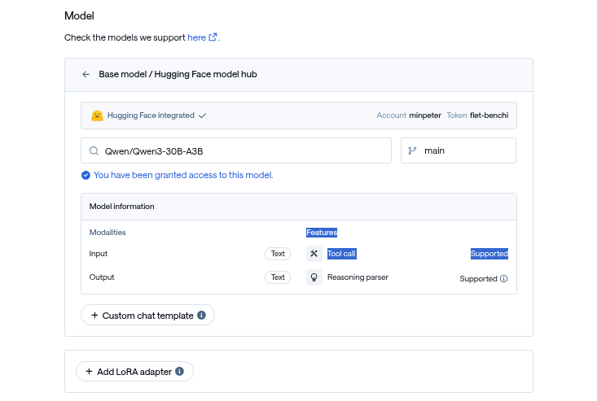
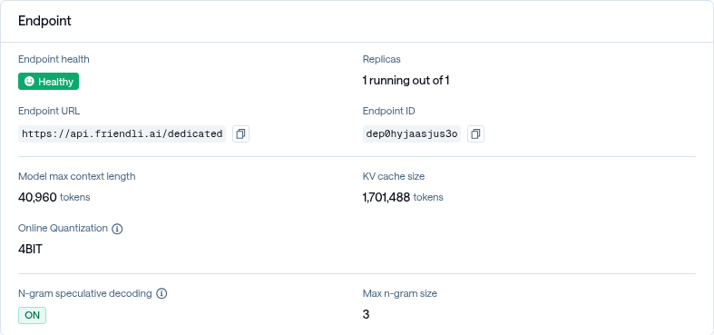

WIP (about ocra-config-wand)

Friendli Dedicated Endpoints에서 함수 호출 가능한 모델 배포 하는 법

1. [X] 모델 선택
2. [X] create page 사용법
3. [X] 배포 이후 overview
4. [X] API 호출을 통한 함수 호출 검증

안되는 모델에 대한 이야기 (like deepseek r1 0528)

1. [X] 안되는 케이스 소개 (이미지와 함께)
2. [X] 왜 안되는지 간략히 설명
3. [ ] ocra-config-wand의 동작 방식

이를 해결하는 방법 (custom chat template)

1. [ ] 어떻게 non tool call chat template를 tool call chat template으로 수정하는지 (무엇이 중요한지)
2. [ ] 수정 예시와 함께 설명
3. [ ] 엔드포인트 생성시 탬플릿 커스터마이징 하는 방법
4. [ ] 배포 후 차이 확인하기

[ ] wrap up


-----

FriendliAI의 완전관리형 모델 서빙 제품인 Friendli Dedicated Endpoints는 안정적이고 편리한 모델 서빙을 지원하며, 여러 기능 중 하나로 함수 호출 설정이 자동으로 감지·활성화되는 기능을 제공한다.


## Dedicated Endpoints에서 함수 호출 가능한 모델 배포 하는 법


예를 들어, `Qwen/Qwen3-30B-A3B` 모델의 경우 아래 순서에 따라서 배포를 진행한 경우 자동으로 함수 호출이 가능한 엔드포인트가 배포되게 된다.

1. 모델 선택 후 Features > Tool call: Supported 확인


2. 배포 후 Endpoint Overview에서 Endpoint ID 확인 (e.g., `dep0hyjaasjus3o`)


3. [`FRIENDLI_TOKEN`](https://friendli.ai/suite/setting/tokens)발급 후 API 요청으로 테스트 (강조된 부분을 주의하여 본인의 값으로 수정)
```text
curl https://api.friendli.ai/dedicated/v1/chat/completions \
  -H "Content-Type: application/json" \
// [!code highlight:1]
  -H "Authorization: Bearer $FRIENDLI_TOKEN" \
  -d '{
// [!code highlight:1]
    "model": "dep0hyjaasjus3o",
    "messages": [
      {"role": "user", "content": "서울 날씨 알려줘"}
    ],
    "tools": [
      {
        "type": "function",
        "function": {
          "name": "get_weather",
          "description": "도시의 현재 날씨를 가져옴",
          "parameters": {
            "type": "object",
            "properties": {
              "location": {"type": "string"}
            },
            "required": ["location"]
          }
        }
      }
    ],
    "tool_choice": "auto"
  }' | jq .choices[].message
```

4. 함수 호출 결과 확인
```json
{
  "content": "\n\n",
  "reasoning_content": "\nOkay, the user is asking for the weather in Seoul. Let me check the tools available. There's a function called get_weather that takes a location parameter. Since the user mentioned \"서울\" which is Seoul, I need to call that function with the location set to Seoul. I should make sure the arguments are correctly formatted in JSON. Alright, the required parameter is location, so I'll structure the tool call accordingly.\n",
  "role": "assistant",
// [!code highlight:10]
  "tool_calls": [
    {
      "function": {
        "arguments": "{\"location\": \"서울\"}",
        "name": "get_weather"
      },
      "id": "call_XIl0NYYMh9jRLhUdhF2OtTjE",
      "type": "function"
    }
  ]
}
```

이렇게 어떠한 추가적인 설정 없이 함수 호출이 가능한 엔드포인트를 배포할 수 있다는 것을 확인할 수 있다.

## 자동으로 설정이 안되는 모델에 대한 이야기

이러한 기능을 이용하다 보면, 일부 모델의 경우 도구 호출이 지원되지 않는다고 표시되는 경우가 있습니다.
알려진 일반적인 경우는 다음과 같습니다.

1. 해당 모델의 chat template에 `tool call`를 랜더링 하기 위한 로직이 없는 경우 (e.g., `google/gemma-3-27b-it`)

2. 모델에는 문제(?)가 없지만, 엔진에서 지원되지 않는 유형의 도구 호출인 경우 (e.g., `meta-llama/Llama-4-Scout-17B-16E-Instruct`)


이러한 이유로 지원되지 않는다고 표시된다고 해서, Dedicated 에서 완전히 도구 호출을 사용하지 못한다는 의미는 아닙니다.  
FDE에서는 chat template를 기반으로 tool call type를 자동으로 감지하고, 설정하기 때문에 chat template과 tool calling에 대한 약간에 이해만 있다면 사용자 정의 chat template를 이용하여 문제를 해결하거나 우회하여 도구 호출이 가능하도록 엔드포인트를 설정할 수 있습니다.

## 이를 해결하는 방법 (custom chat template tip)

이러한 문제를 해결하기 위해 엔진에서 지원하는 형식의 tool call format으로 랜더링을 수행하는 chat template를 모델에 맞게 작성하는 과정을 수행해야합니다.

<Callout type="warn" title="아래에서 설명하는 기능은 고급 기능으로, 의도치 않는 모델 함수 호출 성능 저하를 일으킬 수 있습니다." />

우선, 기존의 모델 chat template를 분석하여, instruct, vision, reasoning를 위한 탬플릿 포맷을 정의합니다.
`google/gemma-3-27b-it`처럼 기존에 탬플릿에 tool call을 위한 로직이 없는 경우, 그대로 사용하면 됩니다.

<Tabs items={['gemma-3-27b-it', 'Llama-4-Scout-17B-16E-Instruct', 'Llama-4-Scout-17B-16E-Instruct (diff)']}>
  <Tab value="gemma-3-27b-it">
```jinja
{{- bos_token -}}

	
		
	
		
	
	

	
	



	{%- if message["role"] == "user" != (loop.index0 % 2 == 0) -%}
		{{- raise_exception("Conversation roles must alternate user/assistant/user/assistant/...") -}}
	
	
		
	
		
	
	{{- "<start_of_turn>" + role + "\n" + (first_user_prefix if loop.first else "") -}}
	
		{{- message["content"] | trim -}}
	
		
			
				{{- "<start_of_image>" -}}
			
				{{- item["text"] | trim -}}
			
		
	
		{{- raise_exception("Invalid content type") -}}
	
	{{- "<end_of_turn>\n" -}}



	{{- "<start_of_turn>model\n" -}}

```
  </Tab>
  <Tab value="Llama-4-Scout-17B-16E-Instruct">
```jinja
{{- bos_token -}}

	
		
	
		
	
	

	



	{{- "<|header_start|>system<|header_end|>\n\n" -}}
	{{- system_message -}}
	{{- "<|eot|>" -}}



	{{- "<|header_start|>" + message["role"] + "<|header_end|>\n\n" -}}
	
		{{- message["content"] -}}
	
		
			
				{{- "<|image|>" -}}
			
				{{- content["text"] | trim -}}
			
		
	
	{{- "<|eot|>" -}}



	{{- "<|header_start|>assistant<|header_end|>\n\n" -}}

```
  </Tab>
  <Tab value="Llama-4-Scout-17B-16E-Instruct (diff)">
```diff
  {{- bos_token -}}
- 
- 	
- 
- 
- 	
- 
- 	
- 
- {#  This block extracts the system message, so we can slot it into the right place.  #}
- 
- 	
- 	
- 		
- 	
- 		
- 	
- 	
- 
- 	{#  Since not system_message was provided by user, if tool is provided, system_message is now default tool system message  #}
- 	{#  This system message is from llama website:https://www.llama.com/docs/model-cards-and-prompt-formats/llama4/   #}
- 	{%- set system_message = "You are a helpful assistant and an expert in function composition. You can answer general questions using your internal knowledge OR invoke functions when necessary. Follow these strict guidelines:\n\n1. FUNCTION CALLS:\n- ONLY use functions that are EXPLICITLY listed in the function list below\n- If NO functions are listed (empty function list []), respond ONLY with internal knowledge or \"I don't have access to [Unavailable service] information\"\n- If a function is not in the list, respond ONLY with internal knowledge or \"I don't have access to [Unavailable service] information\"\n- If ALL required parameters are present AND the query EXACTLY matches a listed function's purpose: output ONLY the function call(s)\n- Use exact format: [func_name1(param1=value1, param2=value2), func_name2(...)]\nExamples:\nCORRECT: [get_weather(location=\"Vancouver\"), calculate_route(start=\"Boston\", end=\"New York\")] <- Only if get_weather and calculate_route are in function list\nINCORRECT: get_weather(location=\"New York\")\nINCORRECT: Let me check the weather: [get_weather(location=\"New York\")]\nINCORRECT: [get_events(location=\"Singapore\")] <- If function not in list\n\n2. RESPONSE RULES:\n- For pure function requests matching a listed function: ONLY output the function call(s)\n- For knowledge questions: ONLY output text\n- For missing parameters: ONLY request the specific missing parameters\n- For unavailable services (not in function list): output ONLY with internal knowledge or \"I don't have access to [Unavailable service] information\". Do NOT execute a function call.\n- If the query asks for information beyond what a listed function provides: output ONLY with internal knowledge about your limitations\n- NEVER combine text and function calls in the same response\n- NEVER suggest alternative functions when the requested service is unavailable\n- NEVER create or invent new functions not listed below\n\n3. STRICT BOUNDARIES:\n- ONLY use functions from the list below - no exceptions\n- NEVER use a function as an alternative to unavailable information\n- NEVER call functions not present in the function list\n- NEVER add explanatory text to function calls\n- NEVER respond with empty brackets\n- Use proper Python/JSON syntax for function calls\n- Check the function list carefully before responding\n\n4. TOOL RESPONSE HANDLING:\n- When receiving tool responses: provide concise, natural language responses\n- Don't repeat tool response verbatim\n- Don't add supplementary information\n\nHere is a list of functions in JSON format that you can invoke:\n" -%}
- 
- 	
- 
- {#  Now writing the system message: use the user provided system message if user_provided_system_message, else default tool system message if tools presented  #}
- 
- 	{#  always use user provided system message to override default tool system message  #}
- 	{{- "<|header_start|>system<|header_end|>\n\n" -}}
- 	{{- system_message -}}
- 	
- 		{{- "\nHere is a list of functions in JSON format that you can invoke. Use exact format: [func_name1(param1=value1, param2=value2), func_name2(...)]\n" -}}
- 		{{- tool_definition -}}
- 	
- 		{{- tool_definition -}}
- 	
- 	{{- "<|eot|>" -}}
- 
- {#  Now deal with all other messages  #}
- 
- 	{#  Base case: messages that are not from tool role and has empty tool_call list   #}
- 	
- 		{{- "<|header_start|>" + message["role"] + "<|header_end|>\n\n" -}}
- 		
- 			{{- message["content"] -}}
- 		
- 			
- 				
- 					{{- "<|image|>" -}}
- 				
- 					{{- content["text"] | trim -}}
- 				
- 			
- 		
- 		{{- "<|eot|>" -}}
- 	{#  Tool case: messages has non-empty tool_call list, must from assistant  #}
- 	
- 		{#  assume tool_calls are always coming from assistant  #}
- 		
- 			{{- "<|header_start|>assistant<|header_end|>\n\n" -}}
- 			
- 				{{- message["content"] -}}
- 			
- 				
- 					
- 						{{- "<|image|>" -}}
- 					
- 						{{- content["text"] -}}
- 					
- 				
- 			
- 			{{- "[" -}}
- 			
- 				
- 					
- 				
- 				{{- tool_call.name + "(" -}}
- 				
- 					{{- param + "=\"" -}}
- 					{{- "%s" | format(tool_call.arguments[param]) -}}
- 					{{- "\"" -}}
- 					
- 						{{- ", " -}}
- 					
- 				
- 				{{- ")" -}}
- 				
- 					{{- ", " -}}
- 				
- 			
- 			{{- "]<|eot|>" -}}
- 		
- 	{#  Tool_response case: messages are from tool_response   #}
- 	
- 		{{- "<|header_start|>ipython<|header_end|>\n\n" -}}
- 		
- 			{{- message.content | tojson -}}
- 		
- 			
- 				
- 					{{- content["text"] | tojson -}}
- 				
- 			
- 		
- 		{{- "<|eot|>" -}}
- 	
- 
+ 
+ 	
+ 		
+ 	
+ 		
+ 	
+ 	
+ 
+ 	
+ 
+ 
+ 	{{- "<|header_start|>system<|header_end|>\n\n" -}}
+ 	{{- system_message -}}
+ 	{{- "<|eot|>" -}}
+ 
+ 
+ 	{{- "<|header_start|>" + message["role"] + "<|header_end|>\n\n" -}}
+ 	
+ 		{{- message["content"] -}}
+ 	
+ 		
+ 			
+ 				{{- "<|image|>" -}}
+ 			
+ 				{{- content["text"] | trim -}}
+ 			
+ 		
+ 	
+ 	{{- "<|eot|>" -}}
+ 
  
  	{{- "<|header_start|>assistant<|header_end|>\n\n" -}}
  
```
  </Tab>
</Tabs>