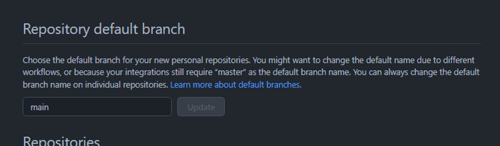
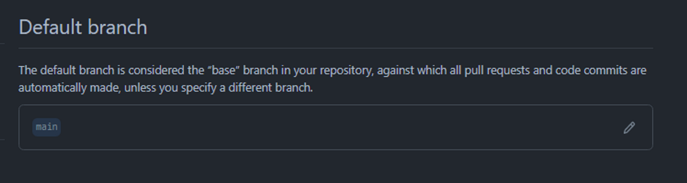

基本的にgitではmasterというブランチが自動的に設定されるようになっています。

しかしLinuxカーネルから始まり、もはやmasterという用語を使わない方が良いと決定されたため、mainに変更することが推奨されています。

とにかくmainが主流で、今後mainブランチをデフォルトブランチとして設定するのが標準になりそうなので、設定を変更しました。

### GitHubでmainをデフォルトに変更する

まずGitHubでデフォルトブランチ設定をmainに変更する必要があります。

[settings → repositories](https://github.com/settings/repositories)



main → update

ただし、これを設定しても今後GitHubで作成するリポジトリに限りmainに設定されるため、すでにmasterに設定されているリポジトリは個別に変更する必要があります。

特定リポジトリのsettings → branches



すべてのリポジトリで実行すればOKです。

私は60個程度だったのですぐに終わりました。

### ローカルでmainをデフォルトに設定する

gitバージョンが2.28以降のバージョンでは、デフォルトブランチ設定を変更するための`init.defaultBranch`設定が新たに導入されました。

設定方法は以下の通りです。

```jsx
git config --global init.defaultBranch main
```

ただし問題は、Ubuntuやその他のDebian環境で何も考えずに`sudo apt install git`をした場合、gitバージョンが2.28以下のバージョンである可能性が高いです。

これは以下の方法でアップグレードできます。

```bash
sudo apt pugre git
sudo apt autoremove -y

sudo add-apt-repository ppa:git-core/ppa
sudo apt update
sudo apt install git
```

では... さようなら？
