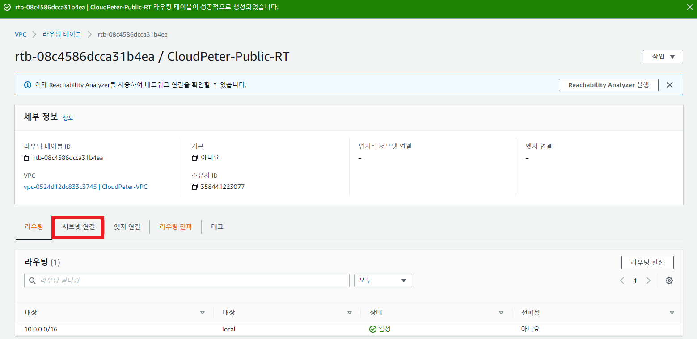

import { ModCodeBlock } from "@/components/code-block";

<Callout>
  このブログで活用できるMDXコンポーネントを実験するための投稿です。
  {"\n"}
  実用的な記事を探しているなら、スキップしてください。
</Callout>

最初からこの**ブログタイトル**に使った`コンポーネント`を使ってみた。{" "}

うまく動作しているのを見ると、MDXがうまく適用されたことが分かる。

import { SimpleButton, Ip, Counter } from "./components";

これでブログでコンポーネントを使用できるようになったので、いくつかの実験をしてみようと思う。

まずインラインコードブロックテスト `console.log("Hello, World!")` をしてみよう。次は一般的なコードブロックテスト

```
console.log("Hello, World!")
```

---

シンプルなボタンコンポーネント

```jsx
export function SimpleButton() {
  const [toggle, setToggle] = useState(false);
  const [count, setCount] = useState(0);

  return (
    <Button
      onClick={() => {
        setToggle(!toggle);
        setCount(count + 1);
      }}
    >
      {toggle ? "You pushed me!!" : "Push me!!"}
    </Button>
  );
}
```

<SimpleButton />

---

ip.minpeter.ukサーバーを利用した読者IP照会コンポーネント

```jsx
export function Ip() {
  const [ip, setIp] = useState("");

  useEffect(() => {
    fetch("https://ip.minpeter.uk/ip").then((res) =>
      res.text().then((ip) => setIp(ip))
    );
  }, []);

  return <span>Your IP: {ip ? ip : "Loading..."}</span>;
}
```

<Ip />

---

シンプルなカウンターコンポーネント

```jsx
export function Counter() {
  const [count, setCount] = useState(0);

  return (
    <div className="space-y-2">
      <p>Count: {count}</p>
      <div className="space-x-1">
        <Button onClick={() => setCount(count + 1)}>Count Up</Button>
        <Button variant={"outline"} onClick={() => setCount(0)}>
          Reset
        </Button>
      </div>
    </div>
  );
}
```

<Counter />

---

> シンプルなのがすごく好きみたいだね (🍄)

# ModCodeBlock, CodeBlock

<ModCodeBlock
  template="
    aws ec2 create-subnet --vpc-id {{vpc-id}} \
    {{%TAB}}--cidr-block {{cidr-block}} \
    {{%TAB}}--availability-zone {{availability-zone}}"
  data={{
    "vpc-id": "vpc-071ecca730edf705f",
    "cidr-block": "10.10.0.0/24",
    "availability-zone": "ap-northeast-1a",
  }}
/>

上でModCodeBlockを使って`vpc-id`、`cidr-block`、`availability-zone`を変数として使用できる。このとき使用される形式はこうだ。

```
<ModCodeBlock
  template="
    aws ec2 create-subnet --vpc-id {{vpc-id}} \
    {{%TAB}}--cidr-block {{cidr-block}} \
    {{%TAB}}--availability-zone {{availability-zone}}"
  data={{
    "vpc-id": "vpc-071ecca730edf705f",
    "cidr-block": "10.10.0.0/24",
    "availability-zone": "ap-northeast-1a",
  }}
/>
```

ここで`{{%TAB}}`はタブのために追加した。今後必要な場合、このような機能を追加できる。

ModCodeBlockの特徴としては、あるコマンドを読者がコピーする前に変更しなければならない値を簡単に修正してからコピーできるということだ。こうすればCLIを中心に進むブログ記事を書くとき、読者が簡単についてこれるようになる。

初めて追加された実用的な用途のMDXコンポーネントだ。これを基本的にすべての投稿で活用できるように`app/blog/[slug]/post.tsx`を次のように修正した。

```
"use client";

import { CodeBlock, ModCodeBlock } from "@/components/code-block";
import "@/styles/mdx.css";

import { getMDXComponent } from "mdx-bundler/client";

export default function PostContent({ code }: any) {
  const Component = getMDXComponent(code);
  return (
    <Component
      components={{
        code: ({ children, className }: any) => {
          const match = /language-(\w+)/.exec(className || "");
          const language = match ? match[1] : "";

          return <CodeBlock language={language} code={children} />;
        },
        ModCodeBlock,
      }}
    />
  );
}

```

こうすれば該当コンポーネントはグローバルで使用できるようになる。

# Heading 1

```java
/**
 * @param {string} names
 * @return {Promise<string[]>}
 */
async function notify(names) {
  const tags = []
  for (let i = 0; i < names.length; i++) {
    tags.push('@' + names[i])
  }
  await ping(tags)
}
class SuperArray extends Array {
  static core = Object.create(null)
  constructor(...args) { super(...args); }
  bump(value) {
    return this.map(
      x => x == undefined ? x + 1 : 0
    ).concat(value)
  }
}
```

```jsx
const element = (
  <>
    <Food
      season={{
        sault: <p a={[{}]} />,
      }}
    ></Food>
    {/* jsx comment */}
    <h1 className="title" data-title="true">
      Read{" "}
      <Link href="/posts/first-post">
        <a>this page! - {Date.now()}</a>
      </Link>
    </h1>
  </>
);
```

## Heading 2

**Paragraphs:**

This is a paragraph.

**Lists:**

- List item 1

  Lorem ipsum dolor sit amet, consectetur adipiscing elit, sed do eiusmod tempor incididunt ut labore et dolore magna aliqua.
  1. test 1

     Lorem ipsum dolor sit amet, consectetur adipiscing elit, sed do eiusmod tempor incididunt ut labore et dolore magna aliqua.

  2. test 2
     - List item 2
     - List item 3

       Lorem ipsum dolor sit amet, consectetur adipiscing elit, sed do eiusmod tempor incididunt ut labore et dolore magna aliqua.

       これはテスト用のコードで

       ```js
       console.log("Hello, World!");
       ```

       そしてこれは画像です

       

- List item 2

  Lorem ipsum dolor sit amet, consectetur adipiscing elit, sed do eiusmod tempor incididunt ut labore et dolore magna aliqua.

---

1. List item 1

   `helloworld` is a code block.

   ```go
   package main

   import (
     "fmt"
   )

   func main() {
     fmt.Println("Hello, World!")
   }
   ```

2. List item 2
   - List item 3
   - List item 4

**Tables:**

| Header | Content |
| ------ | ------- |
| Row 1  | Cell 1  |
| Row 2  | Cell 2  |

**Code:**

```javascript
console.log("Hello, World!");
```

`ping google.com`

**Bold** and _Italic_, ~~Strikethrough~~

[Link](/url)

> This is a quote.

**3. スタイル**

 {/*  */}
