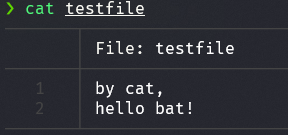
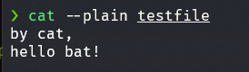
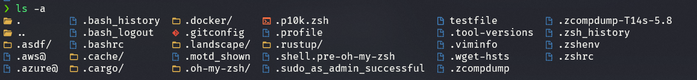

### update log

| 日付 | 変更点 |
| --- | --- |
| 2022/02/18 | 🎺 最初に記事を書いた日 |
| 2022/03/06 | 誤字修正 |
| 2022/08/02 | 誤字修正、asdfインストールコマンドバージョン修正、おすすめプラグインリスト追加、コピペしやすいように記事修正、最新設定に若干修正 |

## 概要

Windowsで開発環境を構築する際、いくつかの不便な点がありました。

存在はするがまだ不十分なパッケージマネージャー (winget)

基本を無視する非POSIXターミナル

それに伴う多くのCLIベースツールの非サポート

一度こじれるとどこから解決すべきかわからないPATH

実は、いくつかはWindowsについて知らないから生じる不便さと問題かもしれません。

でもちょうどMicrosoftがWSLというほぼ完璧なシステムを提供しているので、当然使うべきですよね

とにかくWSLをうまくインストールしましょう

通常`wsl --install -d ubuntu`またはWindows Storeからダウンロードできます。

再起動を行うとubuntuの自動起動とともにLinuxユーザー設定が可能になります。

以下の説明に従ってください

## ソフトウェアアップデート

```bash
sudo apt update && sudo apt upgrade -y && sudo apt autoremove -y
```

## VSCode remote設定

VSCodeで\***\*[Remote - WSL](https://marketplace.visualstudio.com/items?itemName=ms-vscode-remote.remote-wsl)\*\***プラグインをインストール

ターミナルで`code .`を入力

## Git設定

```bash
sudo apt-get install git
git config --global user.name "Your Name"
git config --global user.email "youremail@domain.com"
git config --global credential.helper "/mnt/c/Program\\ Files/Git/mingw64/bin/git-credential-manager.exe"
```

[WindowsのcrlfとWSLのlfの衝突による問題解決](https://code.visualstudio.com/docs/remote/troubleshooting#_resolving-git-line-ending-issues-in-containers-resulting-in-many-modified-files)

## Dockerインストール

```bash
// cmd or pwsh

winget install docker.desktop
```

docker desktop >> settings

General >> Use the WSL 2 based engine

Resources >> WSL INTEGRATION >> (turn on)

## zsh、oh-my-zsh、p10k themeインストール

```bash
sudo apt install zsh
sh -c "$(wget https://raw.github.com/ohmyzsh/ohmyzsh/master/tools/install.sh -O -)"
git clone --depth=1 https://github.com/romkatv/powerlevel10k.git ${ZSH_CUSTOM:-~/.oh-my-zsh/custom}/themes/powerlevel10k
```

p10kテーマの美しさのために[Nerd Fonts](https://github.com/ryanoasis/nerd-fonts)、[Source Code Pro](https://github.com/adobe-fonts/source-code-pro)、[Font Awesome](https://fontawesome.com/)、[Powerline](https://github.com/powerline/fonts)フォントの中から一つを選んでWindowsにインストール後、ターミナルのフォントを変更しましょう

\*\* Nerd Fontsを使用する時のみp10kテーマの全ての設定を有効にできます。

(Meslo Nerd Fontおすすめ)

~/.zshrcファイルの

`ZSH_THEME="robbyrussell"`と書かれた行を `ZSH_THEME="powerlevel10k/powerlevel10k"` に置き換えましょう。

`source ~/.zshrc`でp10kテーマを適用します。

設定ウィザードのような画面が出るので、適当に好みのテーマを設定しましょう。もう一度設定したい場合は`p10k configure`コマンドで可能です。

筆者は以下のように設定しました。 

## oh-my-zshプラグイン

```bash
# zsh-syntax-highlighting
git clone https://github.com/zsh-users/zsh-syntax-highlighting.git ${ZSH_CUSTOM:-~/.oh-my-zsh/custom}/plugins/zsh-syntax-highlighting

# zsh-autosuggestions
git clone https://github.com/zsh-users/zsh-autosuggestions ${ZSH_CUSTOM:-~/.oh-my-zsh/custom}/plugins/zsh-autosuggestions
```

~/.zshrcファイルのplugins項目に以下のように追加します。

```bash
plugins=(
  zsh-syntax-highlighting
  zsh-autosuggestions
)
```

### おすすめプラグインリスト

```bash
plugins=(
  z
  gh
  git
  httpie
  sudo
  rust
  copypath
  direnv
  golang
  python
  docker-compose
  docker
  asdf
  zsh-syntax-highlighting
  zsh-autosuggestions
)
```

`source .zshrc`

## ターミナル入力問題の解決

Windows Terminalとoh-my-zshの何らかの問題により

ターミナルに貼り付けを行う際、一文字ずつゆっくり入力される問題があります。

~~なくなっていれば幸いですが..~~

これを解決するには~/.zshrcに以下の一行を追加します。

```bash
DISABLE_MAGIC_FUNCTIONS="true"
```

その後`source ~/.zshrc`またはターミナルを再起動すると、この問題がなくなったことがわかります。

# ターミナルおすすめツール

## batインストール (clone cat)

[Releases · sharkdp/bat](https://github.com/sharkdp/bat/releases)

```bash
bat_version_amd64.deb <- ダウンロード
sudo dpkg -i bat_version_amd64.deb
```

.zshrcに追加

```bash
alias cat="bat"
```

これできれいなcatに置き換わりました

 覚えておくと良いオプションとして`--plain`があります。以下のように変わり、コピーしやすくなります。 

## logo-lsインストール

[Releases · Yash-Handa/logo-ls](https://github.com/Yash-Handa/logo-ls/releases)

```bash
logo-ls_amd64.deb <- ダウンロード
sudo dpkg -i logo-ls_amd64.deb
```

zshrcに以下の行を追加

```bash
alias ls="logo-ls"
```

lsコマンドにアイコンがつきました。元々の味気ない`ls`コマンドにアイコンがついたことが確認できます。 

## asdfインストール (version manager)

node、python、goのバージョン管理問題を一度に解決できます。

```bash
git clone https://github.com/asdf-vm/asdf.git ~/.asdf --branch v0.10.2
```

`~/.zshrc`に追加

```bash
. $HOME/.asdf/asdf.sh

# append completions to fpath
fpath=(${ASDF_DIR}/completions $fpath)
# initialise completions with ZSH's compinit
autoload -Uz compinit && compinit
```

[ohmyzsh/plugins/asdf at master · ohmyzsh/ohmyzsh](https://github.com/ohmyzsh/ohmyzsh/tree/master/plugins/asdf)

`source ~/.zshrc`

これでasdfコマンドを実行できます。

## asdfを使用してnodeをインストール

nodeプラグインインストール

```bash
asdf plugin-add nodejs https://github.com/asdf-vm/asdf-nodejs.git
```

node最新バージョンインストール

```bash
asdf install nodejs latest
```

nodeシステム全体での使用を宣言

```bash
asdf global nodejs latest
```

## asdfを使用してpythonをインストール

pythonプラグインの依存関係インストール

```bash
sudo apt-get update; sudo apt-get install make build-essential libssl-dev zlib1g-dev \
libbz2-dev libreadline-dev libsqlite3-dev wget curl llvm \
libncursesw5-dev xz-utils tk-dev libxml2-dev libxmlsec1-dev libffi-dev liblzma-dev
```

pythonプラグインインストール

```bash
asdf plugin-add python
```

python最新バージョンインストール

```bash
asdf install python latest
```

pythonシステム全体での使用を宣言

```bash
asdf global python latest
```

## asdfを使用してgolangをインストール

nodeプラグインインストール

```bash
asdf plugin-add golang
```

node最新バージョンインストール

```bash
asdf install golang latest
```

nodeシステム全体での使用を宣言

```bash
asdf global golang latest
```

### asdf使用のコツ 💡

aws-cli、hugoなどのCLIツールのインストールとバージョン管理を助けてくれる良いツールです。一般的にツールのインストールは、先に見たように以下の4つのステップを実行すればインストールされます。

1. 該当ツールのシステム依存関係インストール（場合により異なる）
2. 該当ツールプラグインインストール (plugin-add)
3. ツールの最新バージョンインストール (install)
4. ツールの特定バージョンの全体使用宣言 (global)

## rustupを使用したrustインストール

Rustの場合もasdfでインストールできますが、開発中に問題が発生する場合があるため、rustupを使用したインストールを推奨します。

```bash
curl --proto '=https' --tlsv1.2 -sSf https://sh.rustup.rs | sh
```

選択するようメッセージが表示され、オプション1番を選択（default）

きれいにインストールされます。
